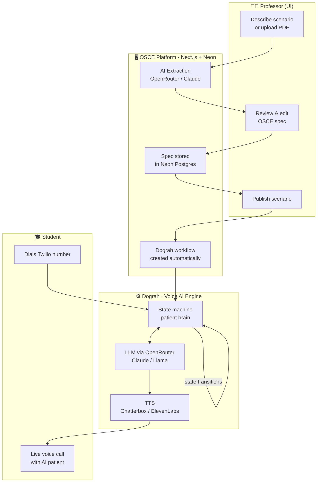

<div align="center">

```
 ██████╗ ███████╗ ██████╗███████╗
██╔═══██╗██╔════╝██╔════╝██╔════╝
██║   ██║███████╗██║     █████╗  
██║   ██║╚════██║██║     ██╔══╝  
╚██████╔╝███████║╚██████╗███████╗
 ╚═════╝ ╚══════╝ ╚═════╝╚══════╝
     Voice Platform
```

**AI-powered OSCE exam simulations via phone call**

[](https://nextjs.org)
[](https://typescriptlang.org)
[](https://prisma.io)
[](https://neon.tech)
[](https://vercel.com)

</div>

---

## 🎯 What is this?

OSCE Voice Platform is a professor-facing dashboard that turns a plain-English scenario description into a fully functional AI patient that medical students can practice with over a **real phone call**.

Professors describe a case. The platform handles everything else — structured spec generation, voice AI configuration, state-machine patient behaviour, and evaluation criteria. Students just dial a number.

---

## ✨ Use Cases

| Who | What they do |
|-----|-------------|
| 🩺 **Medical faculty** | Create and publish realistic patient simulations for OSCE stations |
| 🎓 **Students** | Call a Twilio number and practice history-taking with a lifelike AI patient |
| 🏥 **Simulation centres** | Run standardised, repeatable exam scenarios at scale with no human SPs |
| 📊 **Educators** | Review evaluation criteria automatically scored per call |

---

## 🏗️ Architecture

The platform is a **thin UI layer** on top of [Dograh](https://dograh.com) — a voice AI workflow engine. Professors interact with a clean dashboard; Dograh does all the heavy lifting behind the scenes.



### How it flows

1. **Create** — Professor pastes a clinical description (or uploads a PDF). Claude extracts a validated `OsceSpec`: patient demographics, emotional state machine, evaluation criteria, TTS/LLM config.
2. **Review** — The spec is displayed as an editable preview. Professor can tweak states, transitions, and grading criteria before saving.
3. **Publish** — One click creates two Dograh workflows: a **training** workflow (fast/cheap Llama model) and an **exam** workflow (Claude Sonnet + ElevenLabs voice).
4. **Call** — Students dial the assigned Twilio number. Dograh runs the voice AI loop: speech → LLM (in-character as the patient) → TTS → speech, transitioning emotional states as the conversation progresses.
5. **Evaluate** — Evaluation criteria are scored per call automatically.

---

## 🧠 Patient State Machine

Each scenario defines a set of emotional states and natural-language triggers that move the patient between them. Dograh evaluates the student's questions in real-time and transitions the patient accordingly.

```
        ┌─────────────┐
        │   initial   │  "scared, hasn't seen a doctor in years"
        └──────┬──────┘
               │  student introduces themselves + shows empathy
               ▼
        ┌─────────────┐
        │   guarded   │  "answering but withholding information"
        └──────┬──────┘
               │  student asks about family history
               ▼
        ┌─────────────┐
        │  disclosed  │  "opens up about father's heart attack"
        └──────┬──────┘
               │  student explains findings clearly
               ▼
        ┌─────────────┐
        │  reassured  │  "calm, engaged, asking questions"
        └─────────────┘
```

---

## 📦 Stack

| Layer | Technology |
|-------|-----------|
| **Frontend** | Next.js 16 (App Router), React 19, Tailwind CSS v4 |
| **UI components** | Base UI, shadcn/ui, Lucide icons |
| **Database** | Neon (serverless Postgres), Prisma 7 |
| **AI extraction** | OpenRouter → Claude Sonnet 4.6 |
| **Voice AI engine** | [Dograh](https://dograh.com) (self-hosted, Cloudflare Tunnel) |
| **LLM (training)** | OpenRouter → Llama 3.1 8B |
| **LLM (exam)** | OpenRouter → Claude Sonnet 4.6 |
| **TTS (training)** | Chatterbox |
| **TTS (exam)** | ElevenLabs Turbo v2.5 |
| **Phone** | Twilio |
| **Deploy** | Vercel |

---

## 🚀 Getting Started

### Prerequisites

- Node.js 20+
- A [Neon](https://neon.tech) database
- An [OpenRouter](https://openrouter.ai/keys) API key
- A [Dograh](https://dograh.com) instance (self-hosted, exposed via Cloudflare Tunnel)

### Setup

```bash
git clone https://github.com/your-org/osce-app
cd osce-app
npm install
```

Copy `.env.example` to `.env.local` and fill in:

```env
DATABASE_URL="postgresql://..."         # from Neon dashboard
OPENROUTER_API_KEY="sk-or-v1-..."       # from openrouter.ai/keys
DOGRAH_API_URL="https://your-tunnel.trycloudflare.com"
DOGRAH_API_KEY="..."
NEXT_PUBLIC_APP_URL="http://localhost:3002"
```

Run migrations and start:

```bash
npx prisma db push
npm run dev
```

Open [http://localhost:3002](http://localhost:3002).

---

## 📁 Project Structure

```
src/
├── app/
│   ├── dashboard/          # Scenario list
│   ├── create/             # AI extraction + spec preview
│   ├── osces/[id]/         # Scenario detail + edit
│   │   └── test/           # Pre-publish test mode
│   └── api/
│       └── osces/
│           ├── extract/    # POST — AI spec generation
│           ├── [id]/       # GET / PUT / DELETE scenario
│           └── [id]/publish/ # POST — creates Dograh workflows
├── components/
│   ├── ui/                 # Base UI + shadcn primitives
│   ├── osce-spec-preview   # Editable spec viewer
│   └── publish-button      # Publishes + wires Dograh
└── lib/
    ├── db.ts               # Prisma + Neon adapter
    ├── openrouter.ts       # OpenAI-compatible OpenRouter client
    ├── dograh/client.ts    # Dograh REST API wrapper
    └── schemas/osce.ts     # Zod schema for OsceSpec
```

---

## 🗺️ Roadmap

- [ ] Wire `publish` → `dograh.createWorkflow()` for both modes
- [ ] Live call monitoring dashboard (Dograh webhooks)
- [ ] Per-call evaluation scoring display
- [ ] PDF upload → spec extraction (vision model)
- [ ] Multi-tenant (per-department scenarios)
- [ ] Student analytics & cohort reports

---

## 🔒 Environment Variables

| Variable | Required | Description |
|----------|----------|-------------|
| `DATABASE_URL` | ✅ | Neon Postgres connection string |
| `OPENROUTER_API_KEY` | ✅ | OpenRouter API key for LLM calls |
| `DOGRAH_API_URL` | ✅ | Base URL of your Dograh instance |
| `DOGRAH_API_KEY` | ✅ | Auth key for Dograh API |
| `NEXT_PUBLIC_APP_URL` | ✅ | App URL (used as OpenRouter referer) |

---

<div align="center">

Built on top of [Dograh](https://dograh.com) · Powered by [OpenRouter](https://openrouter.ai) · Deployed on [Vercel](https://vercel.com)

</div>
