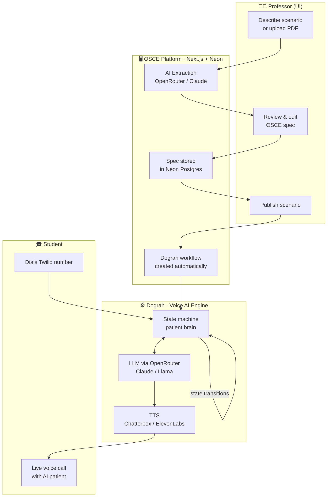

<div align="center">

```
 ██████╗ ███████╗ ██████╗███████╗
██╔═══██╗██╔════╝██╔════╝██╔════╝
██║   ██║███████╗██║     █████╗  
██║   ██║╚════██║██║     ██╔══╝  
╚██████╔╝███████║╚██████╗███████╗
 ╚═════╝ ╚══════╝ ╚═════╝╚══════╝
     Voice Platform
```

**AI-powered OSCE exam simulations via phone call**

[](https://nextjs.org)
[](https://typescriptlang.org)
[](https://prisma.io)
[](https://neon.tech)
[](https://vercel.com)

</div>

---

## 🎯 What is this?

OSCE Voice Platform is a professor-facing dashboard that turns a plain-English scenario description into a fully functional AI patient that medical students can practice with over a **real phone call**.

Professors describe a case. The platform handles everything else — structured spec generation, voice AI configuration, state-machine patient behaviour, and evaluation criteria. Students just dial a number.

---

## ✨ Use Cases

| Who | What they do |
|-----|-------------|
| 🩺 **Medical faculty** | Create and publish realistic patient simulations for OSCE stations |
| 🎓 **Students** | Call a Twilio number and practice history-taking with a lifelike AI patient |
| 🏥 **Simulation centres** | Run standardised, repeatable exam scenarios at scale with no human SPs |
| 📊 **Educators** | Review evaluation criteria automatically scored per call |

---

## 🏗️ Architecture

The platform is a **thin UI layer** on top of [Dograh](https://dograh.com) — a voice AI workflow engine. Professors interact with a clean dashboard; Dograh does all the heavy lifting behind the scenes.



### How it flows

1. **Create** — Professor pastes a clinical description (or uploads a PDF). Claude extracts a validated `OsceSpec`: patient demographics, emotional state machine, evaluation criteria, TTS/LLM config.
2. **Review** — The spec is displayed as an editable preview. Professor can tweak states, transitions, and grading criteria before saving.
3. **Publish** — One click creates two Dograh workflows: a **training** workflow (fast/cheap Llama model) and an **exam** workflow (Claude Sonnet + ElevenLabs voice).
4. **Call** — Students dial the assigned Twilio number. Dograh runs the voice AI loop: speech → LLM (in-character as the patient) → TTS → speech, transitioning emotional states as the conversation progresses.
5. **Evaluate** — Evaluation criteria are scored per call automatically.

---

## 🧠 Patient State Machine

Each scenario defines a set of emotional states and natural-language triggers that move the patient between them. Dograh evaluates the student's questions in real-time and transitions the patient accordingly.

```
        ┌─────────────┐
        │   initial   │  "scared, hasn't seen a doctor in years"
        └──────┬──────┘
               │  student introduces themselves + shows empathy
               ▼
        ┌─────────────┐
        │   guarded   │  "answering but withholding information"
        └──────┬──────┘
               │  student asks about family history
               ▼
        ┌─────────────┐
        │  disclosed  │  "opens up about father's heart attack"
        └──────┬──────┘
               │  student explains findings clearly
               ▼
        ┌─────────────┐
        │  reassured  │  "calm, engaged, asking questions"
        └─────────────┘
```

---

## 📦 Stack

| Layer | Technology |
|-------|-----------|
| **Frontend** | Next.js 16 (App Router), React 19, Tailwind CSS v4 |
| **UI components** | Base UI, shadcn/ui, Lucide icons |
| **Database** | Neon (serverless Postgres), Prisma 7 |
| **AI extraction** | OpenRouter → Claude Sonnet 4.6 |
| **Voice AI engine** | [Dograh](https://dograh.com) (self-hosted, Cloudflare Tunnel) |
| **LLM (training)** | OpenRouter → Llama 3.1 8B |
| **LLM (exam)** | OpenRouter → Claude Sonnet 4.6 |
| **TTS (training)** | Chatterbox |
| **TTS (exam)** | ElevenLabs Turbo v2.5 |
| **Phone** | Twilio |
| **Deploy** | Vercel |

---

## 🎙️ Supported Models

### LLM (via OpenRouter)

Any OpenRouter model can be used — just paste the model ID into the scenario spec. Recommended:

| Model ID | Use case |
|---|---|
| `anthropic/claude-sonnet-4-6` | Exam mode — best quality |
| `meta-llama/llama-3.1-8b-instruct` | Training mode — fast & cheap |
| `deepseek/deepseek-chat-v4-5-flash` | Training mode — fast, good quality |
| `google/gemini-flash-1.5` | Training mode — low latency |

### TTS Voice (per scenario)

Controlled by `tts_voice` in the scenario spec. Add/remove options via `NEXT_PUBLIC_ENABLED_VOICES` in `.env.local`.

| Key | Provider | Model | Notes |
|---|---|---|---|
| `openai-nova` | OpenAI | `gpt-4o-mini-tts` | Fast, natural — default |
| `orpheus-tara` | speaches (OpenRouter) | `canopylabs/orpheus-3b-0.1-ft` | Highly emotional |
| `zonos` | speaches (OpenRouter) | `zyphra/zonos-v0.1-hybrid` | Expressive |
| `elevenlabs-rachel` | ElevenLabs | `eleven_multilingual_v2` | Professional quality |

To add a new voice, add an entry to `TTS_VOICES` in `src/lib/schemas/osce.ts` with its `dograh` config (tts_provider, tts_model, voice_id).

### Transcriber

OpenAI Whisper (`whisper-1`) via the OpenAI key configured in Dograh.

---

## 🚀 Getting Started

### Prerequisites

- Node.js 20+
- A [Neon](https://neon.tech) database
- An [OpenRouter](https://openrouter.ai/keys) API key
- A [Dograh](https://dograh.com) instance (self-hosted, exposed via Cloudflare Tunnel)

### Setup

```bash
git clone https://github.com/your-org/osce-app
cd osce-app
npm install
```

Copy `.env.example` to `.env.local` and fill in:

```env
DATABASE_URL="postgresql://..."         # from Neon dashboard
OPENROUTER_API_KEY="sk-or-v1-..."       # from openrouter.ai/keys
DOGRAH_API_URL="https://your-tunnel.trycloudflare.com"
DOGRAH_API_KEY="..."
NEXT_PUBLIC_APP_URL="http://localhost:3002"
```

Run migrations and start:

```bash
npx prisma db push
npm run dev
```

Open [http://localhost:3002](http://localhost:3002).

---

## 🐳 Deploying Dograh (Self-Hosted)

Dograh runs as a set of Docker containers. These notes cover the non-obvious issues you'll hit deploying it to a fresh VPS.

### Recommended server

Hetzner CPX21 (3 vCPU, 4GB RAM, 80GB SSD) — $13.99/mo. The 2GB CPX11 is too small. GCP e2-micro (1GB RAM) won't work. Pick **Docker CE** as the app image when creating the server so Docker is pre-installed.

### SSH access

When creating the server, add your SSH public key in the Hetzner UI **before** creating the server. If you need to generate one:

```bash
ssh-keygen -t ed25519 -C "your-comment"
# Press enter to accept default path (~/.ssh/id_ed25519)
cat ~/.ssh/id_ed25519.pub  # paste this into Hetzner
```

Connect with:
```bash
ssh -i ~/.ssh/id_ed25519 root@<your-server-ip>
```

**Important:** When adding a Hetzner firewall, always include port 22 (TCP inbound) or you will lock yourself out.

### Setup

```bash
# On the server
git clone https://github.com/dograh-hq/dograh .
cp .env.example .env
# Edit .env — see required vars below
docker compose up -d
```

### Required `.env` values

```env
REGISTRY=ghcr.io/dograh-hq
BACKEND_API_ENDPOINT=http://api:8000       # must use Docker service name, not public IP
MINIO_PUBLIC_ENDPOINT=http://<your-ip>:9000
ENVIRONMENT=local
ENABLE_TELEMETRY=true
OSS_JWT_SECRET=<random string>
```

`BACKEND_API_ENDPOINT` **must be `http://api:8000`** (Docker internal hostname). If you set it to your public IP (e.g. `http://178.x.x.x:8000`), the UI will return 404 on login because it can't proxy requests back through the public IP.

### Postgres password fix

On first run, if the API crashes with `InvalidPasswordError`, the Postgres volume was initialised with a different password than what the API expects. Fix it:

```bash
# Add trust auth for Docker internal network
docker compose exec postgres bash -c \
  "echo 'host all all 172.18.0.0/16 trust' >> /var/lib/postgresql/data/pg_hba.conf \
   && psql -U postgres -c 'SELECT pg_reload_conf();'"
docker compose restart api
```

### Login won't work (cookies)

The Dograh UI sets cookies with the `Secure` flag, which means they **only work over HTTPS**. Accessing the UI via plain `http://<ip>:3010` will let you reach the login page but auth will never stick — it always bounces back.

**Fix:** use the built-in Cloudflare tunnel. By default the tunnel points to the API port. Change it to point to the UI:

```bash
sed -i 's|--url http://api:8000|--url http://ui:3010|' docker-compose.yaml
docker compose up -d --force-recreate cloudflared
docker compose logs cloudflared --tail=20
# Look for: https://xxxx.trycloudflare.com
```

Use that `https://` URL to access the UI. Login will work.

> Note: quick Tunnel URLs are random and change every restart. For a stable URL, set up a [named Cloudflare Tunnel](https://developers.cloudflare.com/cloudflare-one/connections/connect-apps) with a real domain.

### Connect the Next.js app

Once Dograh is running, update `.env.local`:

```env
DOGRAH_API_URL="http://<your-server-ip>:8000"
```

---

## 📁 Project Structure

```
src/
├── app/
│   ├── dashboard/          # Scenario list
│   ├── create/             # AI extraction + spec preview
│   ├── osces/[id]/         # Scenario detail + edit
│   │   └── test/           # Pre-publish test mode
│   └── api/
│       └── osces/
│           ├── extract/    # POST — AI spec generation
│           ├── [id]/       # GET / PUT / DELETE scenario
│           └── [id]/publish/ # POST — creates Dograh workflows
├── components/
│   ├── ui/                 # Base UI + shadcn primitives
│   ├── osce-spec-preview   # Editable spec viewer
│   └── publish-button      # Publishes + wires Dograh
└── lib/
    ├── db.ts               # Prisma + Neon adapter
    ├── openrouter.ts       # OpenAI-compatible OpenRouter client
    ├── dograh/client.ts    # Dograh REST API wrapper
    └── schemas/osce.ts     # Zod schema for OsceSpec
```

---

## 🗺️ Roadmap

### 🔧 POC (in progress)
- [ ] Wire `publish` → `dograh.createWorkflow()` for training + exam modes
- [ ] Inline spec editing (patient fields, states, transitions, evaluation criteria)
- [ ] Browser test call via Dograh embed (no phone needed)
- [ ] Live call monitoring dashboard (Dograh webhooks → run status)
- [ ] Per-call evaluation scoring display

### 🚀 v1
- [ ] PDF upload → spec extraction (vision model)
- [ ] Visual state machine diagram (read-only flow view of patient journey)
- [ ] Multi-tenant (per-department scenarios)
- [ ] Student analytics & cohort reports

### 💡 Future
- [ ] **SMS during call** — narrator sends contextual text messages to the student mid-call (e.g. "patient's blood pressure drops", lab results) via Twilio SMS
- [ ] **Image texting** — send MMS images during the call (X-rays, ECGs, rashes) as clinical prompts
- [ ] **Multi-character SMS** — narrator, patient, and family members can all text the student simultaneously, each with their own voice and personality
- [ ] **Multiple voices per scenario** — assign distinct ElevenLabs voices to each character (anxious patient vs. calm narrator vs. concerned relative)
- [ ] **Ambient sound** — background noise per state (hospital ward, home, A&E) via Dograh ambient audio nodes
- [ ] **Post-call debrief** — AI-generated per-student feedback based on transcript + evaluation criteria

---

## 🔒 Environment Variables

| Variable | Required | Description |
|----------|----------|-------------|
| `DATABASE_URL` | ✅ | Neon Postgres connection string |
| `OPENROUTER_API_KEY` | ✅ | OpenRouter API key for LLM calls |
| `DOGRAH_API_URL` | ✅ | Base URL of your Dograh instance |
| `DOGRAH_API_KEY` | ✅ | Auth key for Dograh API |
| `NEXT_PUBLIC_APP_URL` | ✅ | App URL (used as OpenRouter referer) |

---

<div align="center">

Built on top of [Dograh](https://dograh.com) · Powered by [OpenRouter](https://openrouter.ai) · Deployed on [Vercel](https://vercel.com)

</div>
